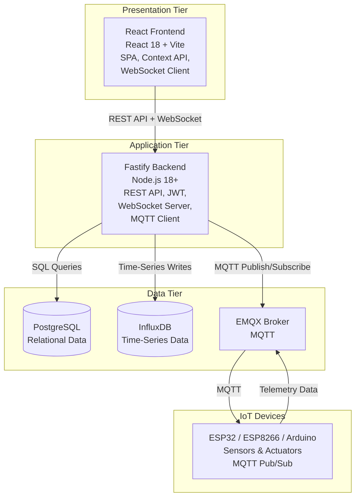
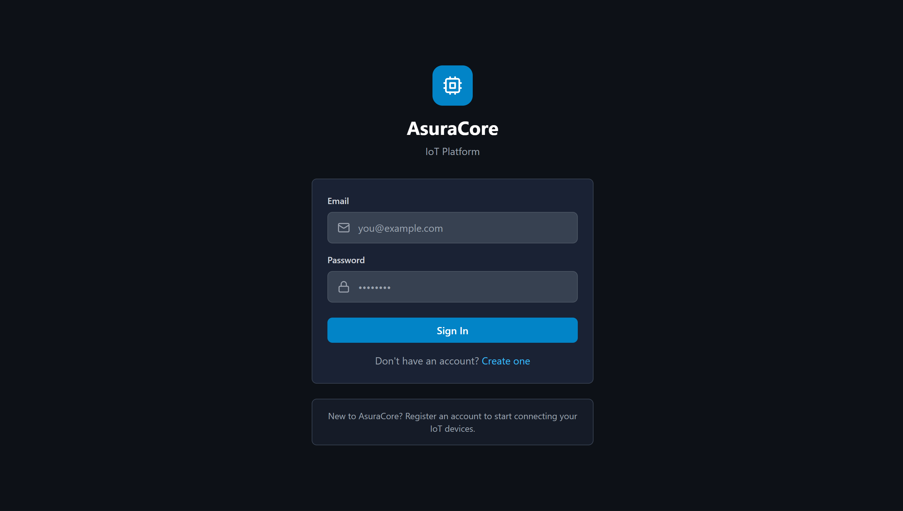
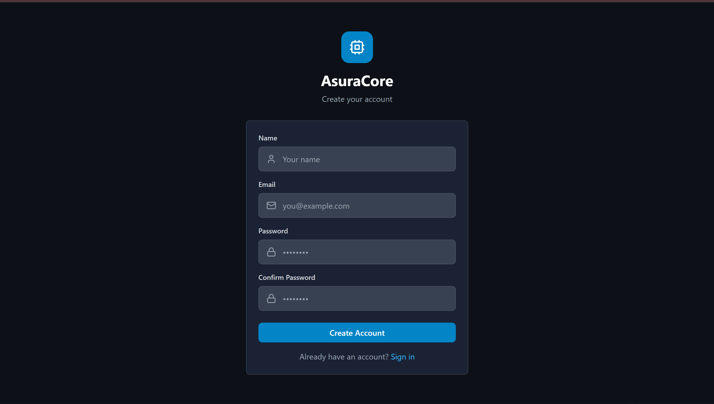
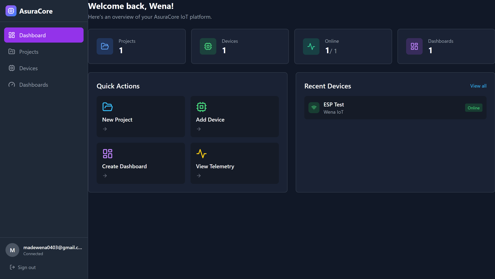
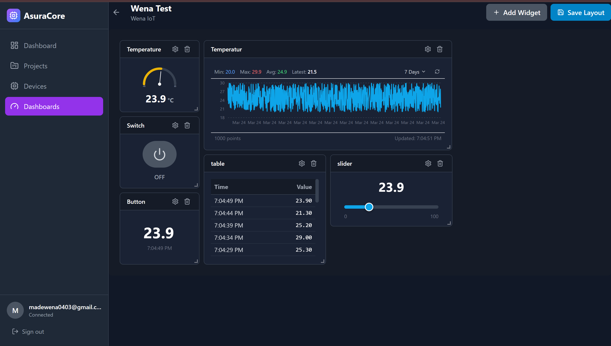
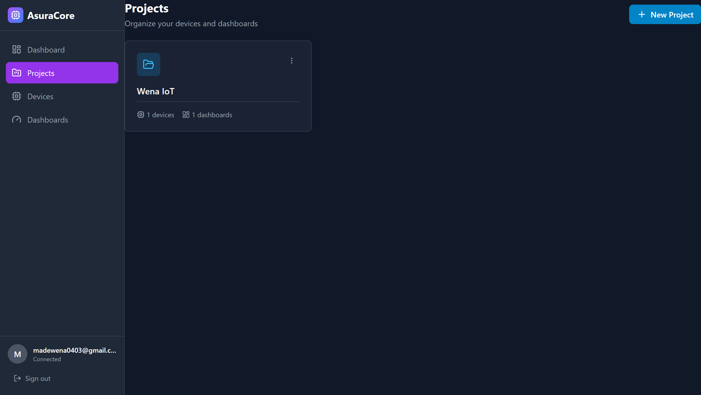
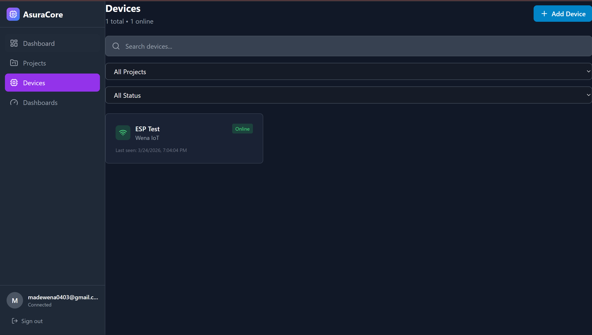
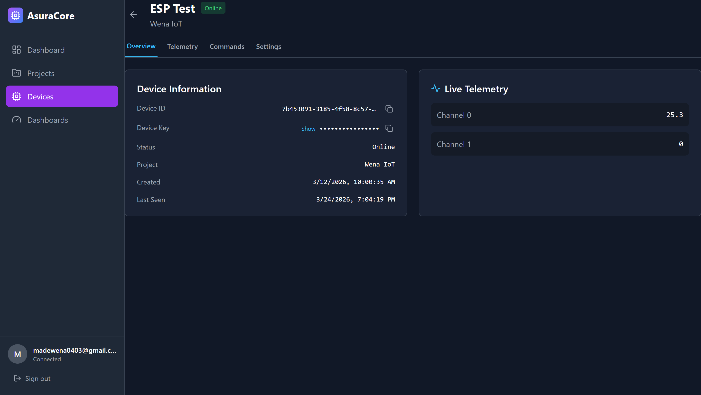
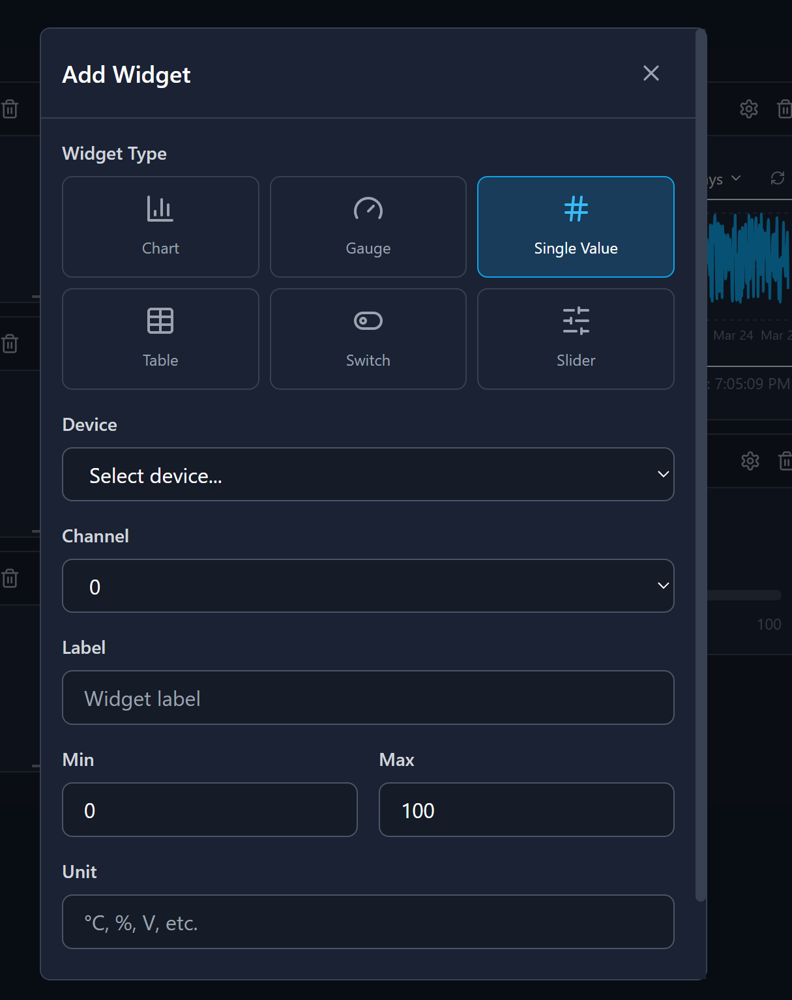

# AsuraCore IoT Platform - Complete Documentation

**AsuraCore** is a modular, extensible, and production-ready IoT platform designed for ESP32, ESP8266, and Arduino-based devices. Build complete IoT solutions with account registration, multi-project management, real-time device connectivity, telemetry streaming, dynamic dashboards, and remote command execution.

---

## 📋 Table of Contents

### 1. Getting Started & Overview
- [Features](#key-features)
- [Tech Stack](#tech-stack)
- [Project Structure](#project-structure)
- [Quick Start](#quick-start)
- [Architecture Overview](#system-architecture-overview)

### 2. Architecture & System Design
- [System Architecture Overview](#system-architecture-overview)
- [Core Components](#core-components)
- [Frontend Layer](#21-frontend-react)
- [Backend Layer](#22-backend-fastify)
- [Database Schema](#23-database-schema)
- [MQTT Broker Setup](#24-mqtt-broker-emqx)
- [Firmware Architecture](#25-iot-firmware-esp32arduino)
- [WebSocket Implementation](#26-websocket-layer)
- [Data Flow Patterns](#data-flow-patterns)
- [Security Architecture](#security-architecture-deep-dive)
- [Scalability & Performance](#scalability-considerations)

### 3. User Interface & Features
- [Application Screenshots](#application-screenshots)
- [Supported Widgets](#dashboard-widget-types)
- [UI Features](#key-features-demonstrated)
- [Usage Examples](#usage-tips)

### 4. Development Guide
- [API Client Documentation](#api-client-usage-guide)
- [API Modules Reference](#api-modules-reference)
- [Frontend Development](#frontend-development)
- [Backend Development](#backend-development)
- [Firmware Development](#firmware-development)

### 5. Configuration & Deployment
- [Environment Variables](#environment-configuration-complete)
- [Prerequisites](#prerequisites)
- [Installation](#installation-steps)
- [Docker Setup](#docker-setup)
- [Reverse Proxy Configuration](#reverse-proxy-setup-nginx)
- [SSL/TLS Setup](#ssl-configuration)
- [Verification](#deployment-verification-checklist)

### 6. Operations & Maintenance
- [Monitoring & Health Checks](#monitoring-and-observability)
- [Database Management](#database-operations)
- [MQTT Operations](#mqtt-operations)
- [Logs & Debugging](#logs-and-debugging)
- [Backup & Recovery](#backup-and-recovery)
- [Secret Rotation](#secret-rotation-procedures)
- [Performance Optimization](#performance-optimization)

### 7. Troubleshooting & Support
- [Common Issues](#troubleshooting-guide)
- [FAQ](#frequently-asked-questions)
- [Getting Help](#getting-help)
- [Quick Reference Commands](#quick-reference-commands)

### 8. Additional Resources
- [Changelog](#changelog)
- [Contributing](#contributing)
- [License](#license)
- [Support & Community](#community)

---

## 🎯 Key Features

### Core Features
✅ **Real-Time Monitoring**
- Live sensor data streaming via WebSocket
- Push-based architecture (no polling)
- Sub-second latency updates
- Automatic reconnection handling

✅ **Device Management**
- One-click device registration
- Per-device configuration & control
- Device online/offline tracking
- Connection history & logging
- Bulk device management API

✅ **Dashboard Builder**
- Drag-and-drop widget placement
- Multiple dashboard support
- Responsive mobile-friendly design
- Widget state persistence
- Export/import functionality

✅ **Data Visualization**
- Real-time line charts
- Gauge displays with thresholds
- Status indicators
- Data tables with sorting
- Historical data playback

✅ **Security & Authentication**
- JWT-based token authentication
- bcrypt password hashing (10 rounds)
- Role-based access control (by project)
- Device key management
- Automatic token refresh

✅ **Time-Series Analytics**
- High-frequency telemetry storage
- Automatic data aggregation
- Retention policies (configurable)
- Time-range queries
- Statistical analysis

✅ **MQTT Protocol**
- Reliable pub/sub messaging
- QoS 1 delivery guarantee
- Topic-based organization
- Device-to-backend communication
- Command & control patterns

✅ **Multi-Device Support**
- ESP32, ESP8266, Arduino Uno/Mega
- Custom Arduino-compatible boards
- Generic MQTT clients
- Device firmware library included

✅ **Scalability**
- Stateless backend architecture
- Horizontal load balancing
- Database connection pooling
- MQTT broker clustering ready
- CDN-compatible static assets

✅ **Docker & Cloud Ready**
- Complete Docker Compose setup
- Production-grade configuration
- Kubernetes-ready services
- Cloud platform support (AWS, Azure, GCP)

---

## 🛠️ Tech Stack

| Layer | Technology | Version | Purpose |
|-------|-----------|---------|---------|
| **Frontend** | React | 18.x+ | UI framework |
| | Vite | 4.x | Build tool & dev server |
| | React Router | 6.x | Client-side routing |
| | TailwindCSS | 3.x | Utility-first styling |
| | WebSocket API | Native | Real-time communication |
| **Backend** | Node.js | 18.x+ | Runtime |
| | Fastify | 4.x | Web framework |
| | JWT | - | Token-based auth |
| | bcrypt | 5.x | Password hashing |
| | Paho MQTT | 4.x | MQTT client library |
| **Databases** | PostgreSQL | 15+ | Relational data |
| | InfluxDB | 2.x | Time-series metrics |
| **MQTT Broker** | EMQX | 5.x | Message broker |
| **Firmware** | Arduino Framework | - | Microcontroller SDK |
| | WiFi.h | - | WiFi connectivity |
| | PubSubClient | - | MQTT library |
| **Deployment** | Docker | 20.x+ | Container platform |
| | Docker Compose | 2.x+ | Container orchestration |
| | Nginx | 1.x | Reverse proxy |

**Support Matrix:**
- **OS:** Ubuntu 20.04+, Debian 11+, CentOS 8+
- **Browsers:** Chrome 90+, Firefox 88+, Safari 14+, Edge 90+
- **Microcontrollers:** ESP32, ESP8266, Arduino Uno/Mega/Due

---

## 📁 Project Structure

```
asuracore/
│
├── backend/                          # Node.js/Fastify Backend API
│   ├── src/
│   │   ├── index.js                  # Main server entry point
│   │   ├── config/
│   │   │   └── index.js              # Environment & configuration
│   │   ├── middleware/
│   │   │   └── auth.js               # JWT authentication middleware
│   │   ├── routes/
│   │   │   ├── authRoutes.js         # <auth-route> endpoints
│   │   │   ├── projectRoutes.js      # <project-route> endpoints
│   │   │   ├── deviceRoutes.js       # <device-route> endpoints
│   │   │   ├── dashboardRoutes.js    # <dashboard-route> endpoints
│   │   │   ├── widgetRoutes.js       # <widget-route> endpoints
│   │   │   └── telemetryRoutes.js    # <telemetry-route> endpoints
│   │   ├── services/
│   │   │   ├── userService.js        # User CRUD & authentication
│   │   │   ├── projectService.js     # Project management
│   │   │   ├── deviceService.js      # Device registration & control
│   │   │   ├── dashboardService.js   # Dashboard operations
│   │   │   ├── widgetService.js      # Widget configuration
│   │   │   └── telemetryService.js   # Telemetry data handling
│   │   ├── db/
│   │   │   ├── postgres.js           # PostgreSQL connection pool
│   │   │   ├── influxdb.js           # InfluxDB client
│   │   │   └── init.sql              # Database schema
│   │   ├── mqtt/
│   │   │   └── mqttClient.js         # MQTT connection & handlers
│   │   └── websocket/
│   │       └── wsHandler.js          # WebSocket connection handler
│   ├── package.json                  # Dependencies
│   ├── package-lock.json
│   └── .env.example                  # Environment template
│
├── frontend/                         # React Web Application
│   ├── src/
│   │   ├── main.jsx                  # React entry point
│   │   ├── App.jsx                   # Root component
│   │   ├── index.css                 # Global styles
│   │   ├── api/
│   │   │   └── index.js              # Centralized API client
│   │   ├── pages/
│   │   │   ├── LoginPage.jsx         # User login
│   │   │   ├── RegisterPage.jsx      # Account creation
│   │   │   ├── DashboardPage.jsx     # Main dashboard view
│   │   │   ├── DashboardsListPage.jsx # All dashboards
│   │   │   ├── DashboardBuilderPage.jsx # Widget editor
│   │   │   ├── ProjectsPage.jsx      # All projects
│   │   │   ├── ProjectDetailPage.jsx # Project view
│   │   │   ├── DevicesPage.jsx       # All devices
│   │   │   └── DeviceDetailPage.jsx  # Device configuration
│   │   ├── components/
│   │   │   └── Layout.jsx            # Page layout wrapper
│   │   ├── widgets/
│   │   │   ├── ChartWidget.jsx       # Line chart widget
│   │   │   ├── GaugeWidget.jsx       # Circular gauge widget
│   │   │   ├── SingleValueWidget.jsx # Text display widget
│   │   │   ├── SliderWidget.jsx      # Interactive slider
│   │   │   ├── StatusWidget.jsx      # Status indicator
│   │   │   ├── SwitchWidget.jsx      # Toggle control
│   │   │   ├── TableWidget.jsx       # Data table
│   │   │   └── index.js              # Widget exports
│   │   ├── context/
│   │   │   └── AuthContext.jsx       # Authentication state
│   │   └── hooks/
│   │       └── useWebSocket.js       # WebSocket hook
│   ├── index.html
│   ├── nginx.conf                    # Nginx configuration
│   ├── tailwind.config.js            # TailwindCSS config
│   ├── postcss.config.js
│   ├── vite.config.js                # Vite build config
│   ├── package.json
│   ├── package-lock.json
│   └── .env.example
│
├── firmware/                         # ESP32/Arduino Firmware
│   ├── libraries/
│   │   └── AsuraCore/
│   │       ├── AsuraCore.cpp         # Core library implementation
│   │       ├── AsuraCore.h           # Core library header
│   │       ├── library.json          # Arduino library config
│   │       ├── library.properties
│   │       ├── README.md
│   │       └── examples/
│   │           ├── Basic/
│   │           │   └── Basic.ino     # Simple LED + sensor
│   │           ├── DHT_Sensor/
│   │           │   └── DHT_Sensor.ino # Temperature/humidity
│   │           ├── RGB_LED/
│   │           │   └── RGB_LED.ino   # RGB LED control
│   │           └── SwitchSlider/
│   │               └── SwitchSlider.ino # Multi-control
│   ├── platformio.ini
│   └── README.md
│
├── docker/                           # Docker Configuration
│   ├── backend.Dockerfile
│   ├── frontend.Dockerfile
│   └── nginx.conf
│
├── img/                              # Screenshots & Images
│   ├── login_page.png
│   ├── register_page.png
│   ├── main_dashboard.png
│   ├── monitoring_dashboard.png
│   ├── project_list.png
│   ├── device_list.png
│   ├── device_information.png
│   └── customizable_widget.png
│
├── docker-compose.yml                # Multi-container configuration
├── .env.example                      # Root environment template
├── .gitignore                        # Git ignore rules
├── CHANGELOG.md                      # Version history
├── README.md                         # This documentation
└── LICENSE                           # MIT License

```

---

## 🚀 Quick Start

### For Local Development (5 minutes)

```bash
# 1. Clone repository
git clone https://github.com/yourusername/asuracore.git
cd asuracore

# 2. Create environment file
cp .env.example .env

# 3. Edit with your secure values
nano .env
# Set: POSTGRES_PASSWORD, INFLUXDB_TOKEN, JWT_SECRET, etc.

# 4. Start all services
docker-compose up -d

# 5. Verify services are running
docker-compose ps

# 6. Access the application
# Frontend: http://localhost:3000
# Backend API: http://localhost:4000
# EMQX Dashboard: http://localhost:18083 (user: admin)
```

### For Production Deployment (30 minutes)

```bash
# 1-3. Same as local development

# 4. Configure reverse proxy (Nginx Proxy Manager)
# See: Reverse Proxy Setup section below

# 5. Update environment variables
nano .env
# Set: FRONTEND_API_URL=https://<your-domain>/api/asura
#      FRONTEND_WS_URL=wss://<your-domain>/api/asura

# 6. Rebuild frontend with new URLs
docker-compose build frontend

# 7. Start services
docker-compose up -d

# 8. Verify deployment
curl https://<your-domain>/
curl https://<your-domain>/api/asura/<server-endpoint>
```

---

## 🏗️ System Architecture Overview

### Three-Tier Architecture

AsuraCore uses a **distributed three-tier architecture** optimized for scalability and real-time IoT applications:



### Architecture Benefits

- **Stateless Backend**: Enables horizontal scaling behind load balancer
- **Real-Time Messaging**: MQTT for reliable device-to-backend communication
- **Dual Database**: PostgreSQL for structure, InfluxDB for high-frequency metrics
- **WebSocket Layer**: Push-based updates (no polling required)
- **Device-Agnostic**: Any MQTT-capable device can connect
- **Microservices Ready**: Can be refactored into independent services
- **Cloud Native**: Works with Kubernetes and cloud platforms

---

## 📊 Core Components

### 2.1 Frontend (React)

**Technology Stack:**
- React 18.x with Hooks
- Vite for fast development
- React Router 6.x for SPA routing
- TailwindCSS for styling
- WebSocket API for real-time updates
- Context API for state management

**Module Architecture:**

| Module | Responsibility |
|--------|-----------------|
| `api/` | Centralized API client with automatic token injection |
| `pages/` | Route components (Login, Dashboard, Devices, Projects) |
| `components/` | Reusable UI components (Layout, Forms, etc.) |
| `widgets/` | Dashboard widget types (Chart, Gauge, Switch, etc.) |
| `context/` | Global state (AuthContext for user auth) |
| `hooks/` | Custom React hooks (useWebSocket, useAuth, etc.) |

**Component Hierarchy:**
```
App (root)
├── LoginPage / RegisterPage
├── DashboardPage
│   ├── Dashboard (displays widgets)
│   ├── WebSocket listener
│   └── Widgets (Chart, Gauge, Switch, etc.)
├── DashboardBuilderPage
│   ├── Widget palette
│   ├── Drag-and-drop grid
│   └── Widget configuration panel
├── ProjectsPage
├── DevicesPage
│   └── Device detail panel
└── Layout (wraps all pages)
    ├── Header
    ├── Sidebar
    └── Main content area
```

**State Management:**
- AuthContext: Manages user login state & JWT token
- localStorage: Persists auth token
- Component state: For UI interactions
- WebSocket updates: Real-time data from backend

**API Client Integration:**
```javascript
// api/index.js - Centralized client
import axios from 'axios';

const apiClient = axios.create({
  baseURL: process.env.VITE_API_URL || 'http://localhost:4000',
  timeout: 10000,
  headers: {
    'Content-Type': 'application/json'
  }
});

// Auto-inject JWT token
apiClient.interceptors.request.use((config) => {
  const token = localStorage.getItem('asuracore_token');
  if (token) {
    config.headers.Authorization = `Bearer ${token}`;
  }
  return config;
});

// Handle error responses
apiClient.interceptors.response.use(
  response => response,
  error => {
    if (error.response?.status === 401) {
      // Token expired, redirect to login
      window.location.href = '/login';
    }
    return Promise.reject(error);
  }
);

export default apiClient;
```

---

### 2.2 Backend (Fastify)

**Technology Stack:**
- Fastify v4.x (micro-framework)
- Node.js 18+ runtime
- JWT for stateless authentication
- bcrypt v5.x for password hashing
- Paho MQTT client for device communication
- PostgreSQL driver (pg)
- InfluxDB client

**Service Architecture:**

```
backend/src/
├── index.js
│   └── Initializes Fastify, routes, WebSocket
│
├── config/index.js
│   └── Loads & validates environment variables
│       (Throws error if required vars missing)
│
├── routes/
│   ├── authRoutes.js → <auth-route>
│   ├── projectRoutes.js → <project-route>
│   ├── deviceRoutes.js → <device-route>
│   ├── dashboardRoutes.js → <dashboard-route>
│   ├── widgetRoutes.js → <widget-route>
│   └── telemetryRoutes.js → <telemetry-route>
│
├── services/
│   ├── userService.js
│   │   └── register(), login(), getUser()
│   ├── projectService.js
│   │   └── list(), get(), create(), update(), delete()
│   ├── deviceService.js
│   │   └── register(), list(), get(), sendCommand()
│   ├── dashboardService.js
│   │   └── create(), get(), update(), delete()
│   ├── widgetService.js
│   │   └── create(), update(), delete(), updateLayout()
│   └── telemetryService.js
│       └── getLatest(), getHistory(), store()
│
├── middleware/
│   └── auth.js
│       └── Verifies JWT, extracts user data
│
├── db/
│   ├── postgres.js → Connection pool, query helpers
│   ├── influxdb.js → InfluxDB client wrapper
│   └── init.sql → Database schema
│
├── mqtt/
│   └── mqttClient.js
│       ├── Connection management
│       ├── Topic subscription (device/<device_id>/...)
│       └── Message handlers
│
└── websocket/
    └── wsHandler.js
        ├── Connection lifecycle
        ├── Authentication
        └── Message broadcasting
```

**Request Processing Flow:**
```
HTTP Request
    ↓
Route Handler (routes/*.js)
    ↓
Auth Middleware (jwt verification)
    ↓
Service Layer (business logic)
    ↓
Database Layer (postgres/influxdb)
    ↓
JSON Response
```

**API Endpoint Pattern:**

All endpoints use generic placeholders (for security):
```
Authentication
POST /<auth-route>              // Login
POST /<auth-route>              // Register
GET  /<auth-route>              // Get current user

Projects
GET    /<project-route>         // List projects
POST   /<project-route>         // Create project
GET    /<project-route>/:id     // Get single project
PUT    /<project-route>/:id     // Update project
DELETE /<project-route>/:id     // Delete project

Devices
GET    /<device-route>          // List devices
POST   /<device-route>          // Register device
GET    /<device-route>/:id      // Get device details
PUT    /<device-route>/:id      // Update device
DELETE /<device-route>/:id      // Delete device
POST   /<device-route>/:id/command // Send command

Dashboards
GET    /<dashboard-route>       // List dashboards
POST   /<dashboard-route>       // Create dashboard
GET    /<dashboard-route>/:id   // Get dashboard
PUT    /<dashboard-route>/:id   // Update dashboard
DELETE /<dashboard-route>/:id   // Delete dashboard

Widgets
POST   /<widget-route>          // Create widget
PUT    /<widget-route>/:id      // Update widget
DELETE /<widget-route>/:id      // Delete widget
PUT    /<widget-route>/layouts  // Update positions

Telemetry
GET    /<telemetry-route>/:deviceId/:channel/latest
GET    /<telemetry-route>/:deviceId/:channel/history
```

**Example Route Implementation:**
```javascript
// routes/projectRoutes.js
import { projectService } from '../services/projectService.js';

export async function projectRoutes(fastify) {
  // Get all projects for user
  fastify.get('/<project-route>', async (request, reply) => {
    const userId = request.user.id;
    const projects = await projectService.listByUser(userId);
    return reply.send({ projects });
  });

  // Create new project
  fastify.post('/<project-route>', async (request, reply) => {
    const userId = request.user.id;
    const { name, description } = request.body;
    const project = await projectService.create(userId, { name, description });
    return reply.send({ project });
  });

  // Get single project
  fastify.get('/<project-route>/:projectId', async (request, reply) => {
    const { projectId } = request.params;
    const userId = request.user.id;
    const project = await projectService.get(projectId, userId);
    return reply.send({ project });
  });
}
```

---

### 2.3 Database Schema

#### PostgreSQL (Relational Data)

**Schema Overview:**

```sql
-- Users Table
CREATE TABLE users (
  id SERIAL PRIMARY KEY,
  email VARCHAR(255) UNIQUE NOT NULL,
  password_hash VARCHAR(255) NOT NULL,
  name VARCHAR(255),
  created_at TIMESTAMP DEFAULT NOW(),
  updated_at TIMESTAMP DEFAULT NOW()
);

CREATE INDEX idx_users_email ON users(email);

-- Projects Table (organized by user)
CREATE TABLE projects (
  id SERIAL PRIMARY KEY,
  user_id INTEGER NOT NULL REFERENCES users(id) ON DELETE CASCADE,
  name VARCHAR(255) NOT NULL,
  description TEXT,
  created_at TIMESTAMP DEFAULT NOW(),
  updated_at TIMESTAMP DEFAULT NOW()
);

CREATE INDEX idx_projects_user ON projects(user_id);

-- Devices Table (assigned to projects)
CREATE TABLE devices (
  id SERIAL PRIMARY KEY,
  project_id INTEGER NOT NULL REFERENCES projects(id) ON DELETE CASCADE,
  device_name VARCHAR(255) NOT NULL,
  device_key VARCHAR(64) UNIQUE NOT NULL,
  description TEXT,
  last_seen TIMESTAMP,
  online BOOLEAN DEFAULT FALSE,
  created_at TIMESTAMP DEFAULT NOW(),
  updated_at TIMESTAMP DEFAULT NOW()
);

CREATE INDEX idx_devices_project ON devices(project_id);
CREATE INDEX idx_devices_key ON devices(device_key);

-- Dashboards Table (per project)
CREATE TABLE dashboards (
  id SERIAL PRIMARY KEY,
  project_id INTEGER NOT NULL REFERENCES projects(id) ON DELETE CASCADE,
  name VARCHAR(255) NOT NULL,
  description TEXT,
  created_at TIMESTAMP DEFAULT NOW(),
  updated_at TIMESTAMP DEFAULT NOW()
);

CREATE INDEX idx_dashboards_project ON dashboards(project_id);

-- Widgets Table (per dashboard)
CREATE TABLE widgets (
  id SERIAL PRIMARY KEY,
  dashboard_id INTEGER NOT NULL REFERENCES dashboards(id) ON DELETE CASCADE,
  device_id INTEGER REFERENCES devices(id) ON DELETE SET NULL,
  type VARCHAR(50) NOT NULL, -- chart, gauge, switch, status, slider, table, singlevalue
  title VARCHAR(255),
  channel VARCHAR(100), -- e.g., 'temperature', 'humidity', 'relay_1'
  config JSONB, -- { min, max, unit, color, threshold, etc. }
  position_x INTEGER DEFAULT 0,
  position_y INTEGER DEFAULT 0,
  width INTEGER DEFAULT 4,
  height INTEGER DEFAULT 3,
  created_at TIMESTAMP DEFAULT NOW(),
  updated_at TIMESTAMP DEFAULT NOW()
);

CREATE INDEX idx_widgets_dashboard ON widgets(dashboard_id);
CREATE INDEX idx_widgets_device ON widgets(device_id);
```

**Data Relationships:**
```
users (1) ──── (many) projects
projects (1) ──── (many) devices
projects (1) ──── (many) dashboards
dashboards (1) ──── (many) widgets
devices (1) ──── (many) widgets
```

#### InfluxDB (Time-Series Data)

Stores high-frequency sensor measurements optimized for time-range queries.

**Data Structure:**

```
Database: telemetry (default bucket)

Measurement: telemetry_data

Tags (indexed for fast lookups):
  - device_id: "esp32-001"
  - channel: "temperature"
  - project_id: "proj-123"

Fields (stored values):
  - value: 27.3 (float)
  - raw_value: 682 (integer, before conversion)

Timestamp: Unix nanoseconds (automatically set)

Example document:
{
  measurement: "telemetry_data",
  tags: {
    device_id: "esp32-001",
    channel: "temperature",
    project_id: "proj-123"
  },
  fields: {
    value: 27.3,
    raw_value: 682
  },
  timestamp: 1711111111000000000
}
```

**Query Examples:**

```flux
// Get latest value for a sensor
from(bucket: "telemetry")
  |> range(start: -1h)
  |> filter(fn: (r) => r.device_id == "esp32-001" and r.channel == "temperature")
  |> last()

// Historical data (24 hours)
from(bucket: "telemetry")
  |> range(start: -24h)
  |> filter(fn: (r) => r.device_id == "esp32-001" and r.channel == "temperature")

// Hourly average
from(bucket: "telemetry")
  |> range(start: -7d)
  |> filter(fn: (r) => r.device_id == "esp32-001")
  |> aggregateWindow(every: 1h, fn: mean)
```

---

### 2.4 MQTT Broker (EMQX)

**Message Bus for Device-Backend Communication**

**Topic Hierarchy:**

```
asuracore/
├── devices/
│   └── {device_id}/
│       ├── telemetry/          # Devices → Backend (publish)
│       │   ├── temperature     # Float: 25.3
│       │   ├── humidity        # Float: 65.2
│       │   ├── relay_1         # Integer: 0 or 1
│       │   └── {custom_channel} # Any sensor
│       │
│       ├── command/            # Backend → Devices (publish)
│       │   ├── relay_on        # Control relay
│       │   ├── relay_off
│       │   ├── led_brightness  # Brightness: 0-255
│       │   └── {custom_command}
│       │
│       └── status/             # Device status (publish)
│           └── online          # 1 = online, 0 = offline
│
└── system/
    └── health/                 # System statistics
        ├── uptime
        ├── connections
        └── messages_per_sec
```

**Message Format:**

```json
// Telemetry message (device publishes)
{
  "value": 27.3,
  "timestamp": 1711111111,
  "unit": "°C"
}

// Command message (backend publishes)
{
  "command": "relay_on",
  "params": { "relay_id": 1 },
  "timestamp": 1711111111
}

// Command response (device publishes)
{
  "command": "relay_on",
  "success": true,
  "error": null,
  "timestamp": 1711111111
}
```

**EMQX Configuration:**

```
Port: 1883 (MQTT TCP)
Port: 8083 (MQTT WebSocket)
Port: 8084 (MQTT WSS - secure)
Port: 8883 (MQTT SSL)
Dashboard: 18083 (HTTP)

Max connections: 1,000,000+
Message throughput: 1,000+ msg/sec (configurable)
```

---

### 2.5 IoT Firmware (ESP32/Arduino)

**AsuraCore Arduino Library**

**Library Interface:**

```cpp
#include "AsuraCore.h"

AsuraCore asura("device_key_64_chars");

void setup() {
  asura.begin("WiFi_SSID", "WiFi_Pass", "mqtt.server.ip", 1883);
  
  // Register handler for incoming commands
  asura.onReceive(CH_LED, [](AsuraParam param) {
    int value = param.asInt();
    digitalWrite(LED_PIN, value);
  });
}

void loop() {
  asura.run();
  
  // Send sensor data
  static unsigned long lastRead = 0;
  if (millis() - lastRead > 5000) {
    lastRead = millis();
    float temp = readTemperature();
    asura.write(CH_TEMPERATURE, temp);
  }
}
```

**Channel System:**

```
Channels 0-9: Device → Dashboard (sensors)
  CH_TEMPERATURE (0)
  CH_HUMIDITY (1)
  CH_PRESSURE (2)
  ... custom channels

Channels 10+: Dashboard → Device (controls)
  CH_RELAY (10)
  CH_LED (11)
  CH_MOTOR (12)
  ... custom controls
```

**Lifecycle:**

```
1. Initialization
   - Read device key from flash
   - Connect to WiFi (with retry)
   - Connect to MQTT broker
   - Subscribe to command topics

2. Operation Loop
   - Read sensors (DHT, ADC, etc.)
   - Publish telemetry to MQTT
   - Check for incoming commands
   - Execute command handlers
   - Track online status

3. Error Handling
   - Auto-reconnect on Wi-Fi disconnect
   - Exponential backoff (max 30 sec)
   - Graceful degradation
   - Error logging (if EEPROM available)
```

---

### 2.6 WebSocket Layer

**Real-Time Communication with Frontend**

**Connection Lifecycle:**

```
1. Browser initiates WebSocket
   ws://<backend>:4000/socket (or wss:// for secure)

2. Server receives connection
   ├─ Check JWT token in headers
   ├─ Validate token signature & expiration
   ├─ Extract user_id from token
   └─ Accept connection

3. Client subscribes to data
   ├─ Project subscription
   ├─ Device subscription
   └─ Dashboard subscription

4. Real-time data flow
   ├─ MQTT message received
   ├─ Broadcast to subscribed clients
   └─ React component updates

5. Connection termination
   ├─ Browser close
   ├─ Token expiration
   └─ Server shutdown
```

**Message Types:**

| Type | Source | Destination | Frequency |
|------|--------|-------------|-----------|
| `telemetry` | Backend | Frontend | Real-time |
| `device_online` | Backend | Frontend | On connect |
| `device_offline` | Backend | Frontend | On timeout |
| `command_response` | Backend | Frontend | On command |
| `alert` | Backend | Frontend | Conditional |
| `dashboard_update` | Backend | Frontend | On change |

---

## 🔄 Data Flow Patterns

### Pattern 1: Device Uploads Telemetry

```
Step 1: Device reads sensor → 27.3°C
Step 2: Device publishes MQTT
        Topic: asuracore/devices/esp32-001/telemetry/temperature
        Payload: { "value": 27.3 }
Step 3: MQTT Broker routes message
Step 4: Backend MQTT client receives message
Step 5: Validate device & channel
Step 6: Store in InfluxDB
Step 7: Query related dashboards
Step 8: Broadcast via WebSocket to subscribed clients
Step 9: Frontend receives update
Step 10: React component re-renders with new data
        ↓ User sees real-time update (typically <100ms)
```

---

### Pattern 2: User Sends Command to Device

```
Step 1: User clicks button in dashboard
        command = { device: 'esp32-001', action: 'relay_on' }
Step 2: Frontend POST request to /<device-route>/esp32-001/command
Step 3: Backend validates JWT & device ownership
Step 4: Backend publishes MQTT command
        Topic: asuracore/devices/esp32-001/command/relay_on
        QoS: 1 (at-least-once)
Step 5: Device receives & executes command
        digitalWrite(RELAY_PIN, 1)
Step 6: Device publishes response
Step 7: Backend receives response confirmation
Step 8: Backend returns API response (HTTP 200)
Step 9: Frontend updates UI
Step 10: Optional: Device publishes telemetry (feedback)
        ↓ Round-trip typically <500ms
```

---

## 🔐 Security Architecture (Deep Dive)

### Layer 1: Network Security

**Transport Layer:**
```
HTTP  → SSL/TLS redirect → HTTPS
WS    → WSS (WebSocket Secure)
MQTT  → Optionally TLS-encrypted
```

### Layer 2: Authentication

**JWT-Based Stateless Auth:**

```javascript
// Token generation
jwt.sign({
  user_id: 123,
  email: "user@example.com",
  iat: Date.now() / 1000,
  exp: Date.now() / 1000 + 7 * 24 * 60 * 60  // 7 days
}, process.env.JWT_SECRET)

// Token verification (every API request)
jwt.verify(token, process.env.JWT_SECRET)
// If invalid/expired: throw error
```

**Password Security:**
```javascript
// Registration: Hash password with bcrypt
const hash = await bcrypt.hash(password, 10)  // 10 salt rounds
// Store: password_hash in database

// Login: Compare provided password
const match = await bcrypt.compare(password, storedHash)
// Returns: true/false
```

### Layer 3: Authorization

**Project-Level Access Control:**

```javascript
// Only owner can view/edit project
app.get('/<project-route>/:id', authMiddleware, async (req, res) => {
  const userId = req.user.id  // From JWT
  const project = await db.query(
    `SELECT * FROM projects WHERE id = ? AND user_id = ?`,
    [projectId, userId]
  )
  if (!project) return res.status(403).send('Forbidden')
  res.send(project)
})
```

**Device-Level Access Control:**

```javascript
// Device can only access owned projects
// MQTT ACL:
// Device can PUBLISH to: asuracore/devices/{device_id}/*
// Device can SUBSCRIBE to: asuracore/devices/{device_id}/command/*
```

### Layer 4: Data Protection

**In Transit:**
- HTTPS/TLS for API
- WSS for WebSocket
- MQTT over TLS (optional)

**At Rest:**
```sql
-- Password hashing
password_hash VARCHAR(255)  -- bcrypt hashed, never plain text

-- Sensitive fields never logged
// NO: console.log(password, token, deviceKey)
// YES: console.log('User login attempted')
```

**Environment Variables:**
```bash
# Never in code
JWT_SECRET=<random 32+ chars>
POSTGRES_PASSWORD=<random 12+ chars>
INFLUXDB_TOKEN=<random 32+ chars>
MQTT_PASSWORD=<random 12+ chars>

# Never committed to git
.env → .gitignore
.env.example → No secrets, just placeholders
```

---

## 🚀 Scalability Considerations

### Horizontal Scaling

**Stateless Backend:**
```
Load Balancer
  ↓
  ├─ Backend Instance 1
  ├─ Backend Instance 2
  ├─ Backend Instance 3
  └─ Backend Instance N

No sticky sessions needed (JWT is stateless)
Any instance can handle any request
```

**Database Connection Pooling:**
```javascript
const pool = new Pool({
  max: 20,        // Max connections per backend instance
  min: 5,         // Min idle connections
  idleTimeoutMillis: 30000
})

// Multiple instances × 20 connections = better throughput
```

**MQTT Broker Clustering:**
```
EMQX Cluster
  ├─ Node 1 (1883, 8083)
  ├─ Node 2 (1883, 8083)
  └─ Node 3 (1883, 8083)

Devices can connect to any node
Messages replicated across cluster
Load distributed automatically
```

### Caching Strategy

**Backend Caching:**
- Cache device configurations (TTL: 10 min)
- Cache user permissions (TTL: 5 min)
- Cache widget layouts (TTL: 15 min)

---

## 📸 Application Screenshots

### Login Page

**Features:**
- Clean, professional login form
- Email & password input fields
- Secure credential handling
- "Don't have account?" link to registration
- Client & server-side form validation
- Error message display for failed attempts



---

### Registration Page

**Features:**
- User account creation form
- Email, password, and name fields
- Password strength indicator
- Real-time validation feedback
- Terms of service agreement checkbox
- "Already have account?" link to login



---

### Main Dashboard

**Features:**
- Personalized welcome message
- Widget grid layout with drag-and-drop support
- Real-time data visualization
- Multiple dashboard support
- Quick access to projects & devices
- Responsive design for desktop & mobile



---

### Monitoring Dashboard

**Features:**
- Production monitoring view
- Multiple widget types (charts, gauges, switches)
- Real-time sensor data updates via WebSocket
- Interactive widgets with responsive design
- Time-range selection for historical data
- Custom widget configuration



---

### Projects List

**Features:**
- Card-based project listing
- Create new project button
- Project metadata (name, description)
- Quick edit/delete actions
- Project statistics & overview
- Filter & search functionality



---

### Devices List

**Features:**
- Tabular device listing
- Device online/offline status indicators
- Last seen timestamp
- Device identification & metadata
- Quick actions (configure, delete)
- Device statistics & connection logs



---

### Device Information & Configuration

**Features:**
- Comprehensive device details display
- Hardware specifications (IP, MAC address)
- WiFi signal strength indicator
- Firmware version & update info
- Device key management & regeneration
- Configuration panel with advanced settings
- Connection history & logs



---

### Dashboard Widget Customization

**Features:**
- Drag-and-drop widget editor
- Widget palette with multiple types
- Real-time preview while editing
- Widget configuration panel
- Grid layout management
- Position & size customization
- Save & publish functionality



---

## 💻 Frontend Development

### Local Development Setup

```bash
cd frontend
npm install
export VITE_API_URL=http://localhost:4000
npm run dev
```

**Dev Server:** http://localhost:5173 (Vite)

### Component Example

```jsx
// widgets/ChartWidget.jsx
import React, { useEffect, useState } from 'react';
import { useWebSocket } from '../hooks/useWebSocket';

export function ChartWidget({ deviceId, channel, config }) {
  const [data, setData] = useState([]);
  const ws = useWebSocket();

  useEffect(() => {
    const handleMessage = (event) => {
      try {
        const msg = JSON.parse(event.data);
        if (msg.deviceId === deviceId && msg.channel === channel) {
          setData(prev => [...prev.slice(-99), { 
            value: msg.value, 
            timestamp: msg.timestamp 
          }]);
        }
      } catch (e) {
        console.error('WebSocket error:', e);
      }
    };

    ws.addEventListener('message', handleMessage);
    return () => ws.removeEventListener('message', handleMessage);
  }, [deviceId, channel, ws]);

  return (
    <div className="widget">
      <h3>{config.title}</h3>
      <canvas ref={chartRef}></canvas>
    </div>
  );
}
```

---

## 🔧 Backend Development

### Adding New Service

```javascript
// services/customService.js
import { pool } from '../db/postgres.js';

export const customService = {
  async create(userId, data) {
    const result = await pool.query(
      'INSERT INTO custom_table (user_id, data) VALUES ($1, $2) RETURNING *',
      [userId, JSON.stringify(data)]
    );
    return result.rows[0];
  },

  async get(userId) {
    const result = await pool.query(
      'SELECT * FROM custom_table WHERE user_id = $1',
      [userId]
    );
    return result.rows;
  }
};
```

---

## 📡 Firmware Development

### Simple Example

```cpp
#include "AsuraCore.h"

#define DEVICE_KEY "<paste_64_char_key_here>"
#define CH_TEMPERATURE 0
#define CH_RELAY 10

AsuraCore asura(DEVICE_KEY);

void setup() {
  Serial.begin(115200);
  pinMode(5, OUTPUT);
  
  asura.begin("ssid", "password", "<server_ip>", 1883);
  asura.onReceive(CH_RELAY, [](AsuraParam p) {
    digitalWrite(5, p.asInt());
  });
}

void loop() {
  asura.run();
  
  static unsigned long last = 0;
  if (millis() - last > 5000) {
    last = millis();
    float temp = readTemp();
    asura.write(CH_TEMPERATURE, temp);
  }
}
```

---

## 🖥️ Environment Configuration (Complete)

### Required Variables

```bash
# PostgreSQL
POSTGRES_HOST=postgres
POSTGRES_PORT=5432
POSTGRES_DB=asuracore
POSTGRES_USER=asuracore
POSTGRES_PASSWORD=<required>    # Min 12 chars

# InfluxDB
INFLUXDB_URL=http://influxdb:8086
INFLUXDB_ORG=asuracore
INFLUXDB_BUCKET=telemetry
INFLUXDB_PASSWORD=<required>    # Min 12 chars
INFLUXDB_TOKEN=<required>       # 32+ chars

# EMQX MQTT
EMQX_DASHBOARD_PASSWORD=<required>
MQTT_BROKER_URL=mqtt://emqx:1883
MQTT_USERNAME=asuracore_backend
MQTT_PASSWORD=<required>        # Min 12 chars

# Application
JWT_SECRET=<required>           # 32+ chars
JWT_EXPIRES_IN=7d

# Frontend URLs
FRONTEND_API_URL=http://localhost:4000
FRONTEND_WS_URL=ws://localhost:4000
```

### Generating Secure Values

```bash
# 12-char password
openssl rand -base64 12

# 32-char secret
openssl rand -hex 32
```

---

## ✅ Prerequisites

- Docker 20.x+, Docker Compose 2.x+
- Node.js 18+ (for development)
- Domain name & SSL certificate (for production)

---

## 🚀 Installation Steps

### Step 1: Clone Repository

```bash
git clone https://github.com/yourusername/asuracore.git
cd asuracore
```

### Step 2: Create Environment File

```bash
cp .env.example .env

# Generate secure values
JWT_SECRET=$(openssl rand -hex 32)
POSTGRES_PASSWORD=$(openssl rand -base64 12)

# Edit .env with these values
nano .env
```

### Step 3: Build & Start

```bash
docker-compose build
docker-compose up -d

# Verify
docker-compose ps
```

### Step 4: Access Application

- Frontend: http://localhost:3000
- Backend API: http://localhost:4000
- EMQX Dashboard: http://localhost:18083 (admin password from .env)

---

## 🐳 Docker Setup

### Override for Development

Create `docker-compose.override.yml`:

```yaml
version: '3.8'
services:
  backend:
    environment:
      NODE_ENV: development
    command: npm run dev
    volumes:
      - ./backend/src:/app/src
```

### Container Logs

```bash
docker-compose logs -f backend
docker-compose logs -f postgres
docker-compose logs -f influxdb
```

### Database Access

```bash
# PostgreSQL
docker-compose exec postgres psql -U asuracore -d asuracore

# InfluxDB
docker-compose exec influxdb influx
```

---

## 🔄 Reverse Proxy Setup (Nginx)

### Using Nginx Proxy Manager

```
Admin UI: http://localhost:81
Create Proxy Host:
  Domain: your-domain.com
  Forward to: asuracore_backend:4000
  Enable SSL: Let's Encrypt
  Enable WebSocket: Yes
```

### Manual Configuration

```nginx
server {
  listen 443 ssl http2;
  server_name your-domain.com;

  ssl_certificate /etc/letsencrypt/live/your-domain.com/fullchain.pem;
  ssl_certificate_key /etc/letsencrypt/live/your-domain.com/privkey.pem;

  location /api/asura/ {
    proxy_pass http://asuracore_backend:4000;
    proxy_http_version 1.1;
    proxy_set_header Upgrade $http_upgrade;
    proxy_set_header Connection "upgrade";
  }

  location / {
    proxy_pass http://asuracore_frontend:80;
  }
}
```

---

## 🔒 SSL Configuration

```bash
# Using Let's Encrypt
certbot certonly --webroot -w /var/www/html \
  -d your-domain.com

# Auto-renewal
0 12 * * * /usr/bin/certbot renew --quiet
```

---

## ✔️ Deployment Verification Checklist

```bash
# Docker Services
docker-compose ps  # All should be "Up"

# Database Connectivity
curl http://localhost:4000/health

# PostgreSQL
docker-compose exec postgres psql -U asuracore -c "SELECT 1;"

# InfluxDB
curl http://localhost:8086/health

# API Test
curl http://localhost:4000/<server-endpoint>

# WebSocket
# Browser DevTools → Network → WS tab (should show active connection)
```

---

## 📊 Monitoring and Observability

### Health Checks

```bash
# Backend
curl http://localhost:4000/health

# PostgreSQL
docker-compose exec postgres pg_isready -U asuracore

# InfluxDB
curl http://localhost:8086/health

# EMQX
docker-compose exec emqx emqx_ctl status
```

### Logs

```bash
# Real-time
docker-compose logs -f

# Specific service
docker-compose logs -f backend

# Filter
docker-compose logs backend | grep "ERROR"
```

---

## 🔒 Database Operations

### PostgreSQL Backup

```bash
docker-compose exec postgres pg_dump -U asuracore asuracore > backup.sql

# Restore
cat backup.sql | docker-compose exec -T postgres psql -U asuracore asuracore
```

### Maintenance

```bash
# Optimize
docker-compose exec postgres psql -U asuracore -d asuracore \
  -c "VACUUM FULL ANALYZE;"

# Database size
docker-compose exec postgres psql -U asuracore -d asuracore \
  -c "SELECT pg_size_pretty(pg_database_size('asuracore'));"
```

---

## 📡 MQTT Operations

### Testing

```bash
# List topics
docker-compose exec emqx emqx_ctl topics

# Publish test
docker-compose exec emqx mosquitto_pub -h localhost \
  -t "test/topic" -m "hello"

# Subscribe
docker-compose exec emqx mosquitto_sub -h localhost \
  -t "asuracore/devices/+/telemetry/#"
```

---

## 📝 Logs and Debugging

### Backend

```bash
docker-compose logs -f backend
docker-compose logs backend | grep "ERROR"
docker-compose logs backend | grep "MQTT"
```

### Database

```bash
docker-compose logs postgres | grep "duration"
```

---

## 🔄 Secret Rotation Procedures

### Rotate JWT Secret

```bash
# Generate new
NEW_JWT=$(openssl rand -hex 32)

# Update .env
sed -i "s/JWT_SECRET=.*/JWT_SECRET=$NEW_JWT/" .env

# Restart backend
docker-compose up -d backend

# All existing tokens become invalid (users must re-login)
```

### Rotate Database Password

```bash
NEW_PASS=$(openssl rand -base64 12)

# Update
sed -i "s/POSTGRES_PASSWORD=.*/POSTGRES_PASSWORD=$NEW_PASS/" .env

# Change in DB
docker-compose exec postgres psql -U asuracore \
  -c "ALTER ROLE asuracore WITH PASSWORD '$NEW_PASS';"

# Restart backend
docker-compose up -d backend
```

---

## ⚡ Performance Optimization

### Frontend

```javascript
// Code splitting
const Dashboard = React.lazy(() => import('./pages/DashboardPage'));

// Memoization
const Widget = React.memo(({ value }) => <div>{value}</div>);

// WebSocket batching
const batch = [];
ws.onmessage = (e) => {
  batch.push(JSON.parse(e.data));
  if (batch.length >= 100) {
    updateDashboard(batch);
    batch = [];
  }
};
```

### Backend

```javascript
// Connection pooling
const pool = new Pool({ max: 20, min: 5 });

// Rate limiting
app.register(require('@fastify/rate-limit'), {
  timeWindow: '15 minutes',
  cache: 10000
});
```

### Database

```sql
-- Add indexes
CREATE INDEX idx_devices_online ON devices(online);
CREATE INDEX idx_widgets_device_id ON widgets(device_id);

-- Analyze
ANALYZE;
```

---

## 🎯 Troubleshooting Guide

### Backend Won't Start

```bash
# Check logs
docker-compose logs backend

# Common issues:
lsof -i :4000          # Port in use
grep "^[^#]=" .env     # Missing vars
docker-compose ps      # Check databases running
```

### Frontend Can't Reach Backend

```bash
# Check API URL
echo $VITE_API_URL

# Test connectivity
curl http://localhost:4000/health

# WebSocket test
# Browser DevTools → Network → WS tab
```

### Device Won't Connect

```bash
// Check firmware
asura.setDebug(true);  // Enable serial debug
Serial.println("Connecting...");

// Verify:
// 1. Correct device key from dashboard
// 2. Correct MQTT server IP/domain
// 3. WiFi connected
// 4. MQTT port open (1883)
```

---

## ❓ Frequently Asked Questions

**Q: How many devices can I connect?**  
A: Single instance: 100-500. With clustering: 10,000+

**Q: What if WiFi disconnects?**  
A: Device auto-reconnects with exponential backoff. Offline after 60 seconds.

**Q: Can I export data?**  
A: Yes! PostgreSQL dumps and InfluxDB exports.

**Q: How do I change password?**  
A: Dashboard → Settings → Change Password

**Q: Can I run multiple instances?**  
A: Yes, use different ports or separate docker-compose files.

**Q: Is it GDPR compliant?**  
A: No built-in compliance. Add data residency, encryption, audit logging as needed.

---

## 🔄 Quick Reference Commands

### Docker

```bash
docker-compose up -d
docker-compose down
docker-compose logs -f
docker-compose exec backend sh
```

### Database

```bash
docker-compose exec postgres psql -U asuracore -d asuracore
docker-compose exec postgres pg_dump -U asuracore asuracore > backup.sql
```

### API Testing

```bash
curl http://localhost:4000/health
curl -H "Authorization: Bearer $TOKEN" http://localhost:4000/api/asura/<endpoint>
```

### MQTT

```bash
docker-compose exec emqx mosquitto_sub -v -t "asuracore/#"
docker-compose exec emqx mosquitto_pub -t "test" -m "hello"
```

---

## 📋 Changelog

### Version 1.1.0 (March 24, 2026)

**Features:**
- ✅ Complete IoT platform
- ✅ Real-time dashboard
- ✅ Device registration
- ✅ 7 widget types
- ✅ MQTT communication
- ✅ JWT authentication
- ✅ Docker deployment
- ✅ Responsive UI

**Security:**
- ✅ Environment-based config
- ✅ Generic API placeholders
- ✅ JWT tokens
- ✅ bcrypt hashing
- ✅ Device key auth
- ✅ Proper .gitignore

---

## 🤝 Contributing

Contributions welcome! Please:

1. Fork repository
2. Create feature branch
3. Commit changes
4. Push & open PR

---

## 📄 License

This project is licensed under the **MIT License** - Free for personal & commercial use.

See [LICENSE](LICENSE) file for complete license text and terms.

**Key Terms:**
- ✅ You can use this software for any purpose
- ✅ You can modify and distribute it
- ✅ You can include it in proprietary applications
- ⚠️ You must include the license notice in distributions

---

## 🎯 Community

- 🐛 **Issues:** Report on GitHub
- 💬 **Discussions:** Ask questions
- 🌐 **Website:** https://devel-ai.ub.ac.id/asuracore

---

**Last Updated:** March 24, 2026  
**Documentation Version:** 2.0 (Complete)  
**Platform Stability:** Production-Ready  
**License:** MIT

---

**Ready to deploy AsuraCore? Follow the Quick Start section above!** 🚀
